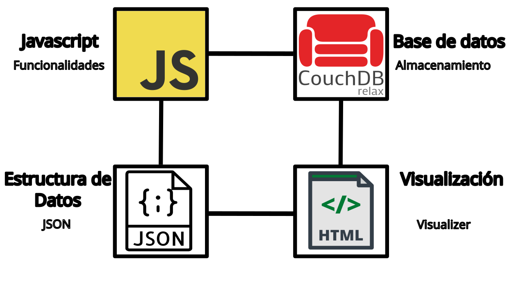

# gat.mylims.org

La plataforma gat.mylims.org es una herramienta diseñada específicamente para la gestión de información científica. Su objetivo es proporcionar a los investigadores una plataforma en línea accesible desde cualquier parte del mundo a través de un navegador web, con la capacidad de almacenar, consultar y analizar datos de manera efectiva.

Para utilizar la plataforma, los investigadores deben disponer de un usuario y contraseña o una cuenta de Google. Una vez autenticados, tendrán acceso a todas las funcionalidades disponibles en la plataforma.

La base de datos de gat.mylims.org está alojada en CouchDB. Toda la información y las herramientas se almacenan en archivos de formato JSON (JavaScript Object Notation), lo que permite una gestión de datos eficiente y la creación de aplicaciones web interactivas.

Todas las funcionalidades de la plataforma, desde el procesamiento de datos hasta el almacenamiento y la consulta, están escritas en lenguaje de programación JavaScript. Esto se traduce en una mayor flexibilidad y facilidad de desarrollo, así como una mayor compatibilidad con las tecnologías web actuales.

El archivo JSON es un formato de archivo fácilmente legible por las computadoras y conveniente para manejar información a nivel de infraestructura. En este sentido, resulta necesario el uso de una herramienta de visualización llamada "Visualizer" que permita la visualización de datos científicos de manera cómoda y fluida. Es por esto que a estas herramientas se les denomina "vistas", ya que a través de ellas, los usuarios pueden visualizar la información de manera accesible.

El "Visualizer" es una aplicación diseñada para mostrar de manera gráfica y visual la información contenida en archivos JSON. El objetivo principal de esta herramienta es proporcionar una forma fácil y eficiente para que los usuarios puedan visualizar y/o analizar los datos científicos contenidos en dichos archivos.

## License

[MIT](./LICENSE)
