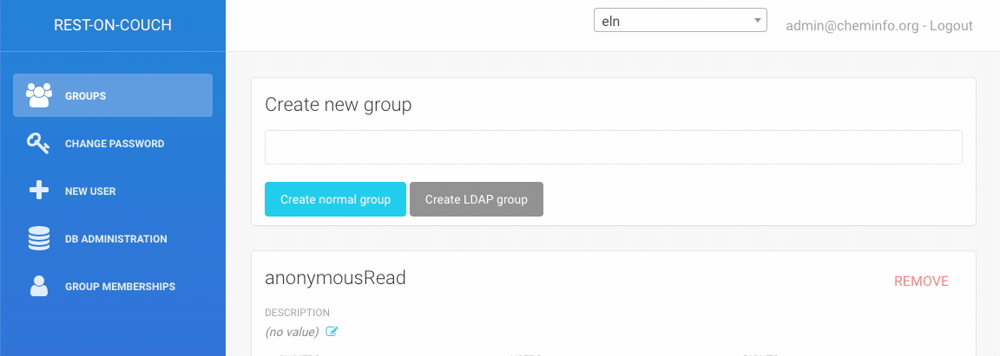

# Desplegando el ELN

## Requisitos del sistema

Para alojar una instancia del ELN no se necesita ningún hardware especial. En principio se puede utilizar un ordenador antiguo con 8 GB de RAM y una CPU antigua.
El sistema en sí no necesitará mucho espacio en el disco duro y el espacio requerido en el disco duro dependerá de la cantidad de datos que desee almacenar (para empezar, incluso 32 GB son suficientes para almacenar >6000 archivos de 5 MB, y la mayoría de los archivos químicos son más pequeños).

Le recomendamos que utilice CentOS (o AlmaLinux) o Ubuntu como sistema operativo.

## Instalando dependencias

### 1. Instale docker y docker-compose y algunas dependencias

On Red Hat Linux/CentOS 8 you need to run the following commands:

```bash
dnf update -y
dnf install epel-release -y
dnf install git -y
```

Verifique que el firewall acepte una conexión externa en el puerto 80 o 443. ¡Agregar esas reglas debe hacerse ANTES de iniciar Docker!

:::tip
Si el `firewalld` está activo, es posible que deba abrir puertos. En CentOS:

```bash
firewall-cmd --permanent --zone=public --add-service=https
firewall-cmd --permanent --zone=public --add-service=http
firewall-cmd --reload
```

:::

Instale `docker` y `docker-compose`. Si está utilizando CentOS o Redhat, consulte el consejo aquí después.

```bash
dnf config-manager --add-repo=https://download.docker.com/linux/centos/docker-ce.repo
dnf install docker-ce –allowerasing
curl -L "https://github.com/docker/compose/releases/download/1.27.4/docker-compose-$(uname -s)-$(uname -m)" -o /usr/local/bin/docker-compose
```

En Ubuntu puedes usar el administrador de paquetes apt para instalar dependencias.

Puede usar [comandos o instaladores similares](https://nodejs.org/en/download/) en otros sistemas operativos.

:::tip
Si está usando AlmaLinux (una alternativa mantenida a CentOS que es compatible binario 1:1 con RHEL®), debe usar `podman` y `podman-compose`.

```bash
dnf install podman dnsmasq podman-plugins python39 -y
pip3 install podman-compose
systemctl start podman
systemctl enable podman
```

y en `vi /root/.bashrc`

```
alias docker='podman'
alias docker-compose='podman-compose'
```

:::

### 2. Configuraciones opcionales

- [En CentOS/Red Hat Linux, es posible que desee deshabilitar permanentemente SE Linux](https://www.rootusers.com/how-to-enable-or-disable-selinux-in-centos-rhel-7/)

```
vi /etc/selinux/config

y defina SELINUX=disabled
```

No olvide que necesita reiniciar la computadora si está cambiando esta configuración.

- Si está detrás de un proxy corporativo, puede seguir [la guía para configurar Docker para usar el proxy](https://docs.docker.com/engine/admin/systemd/#/http-proxy)

## Obtención del código ELN y ejecución

### 1. Inicie el docker daemon si no está utilizando podman

```bash
systemctl start docker
systemctl enable docker
```

### 2. Clone este repositorio

Le recomendamos que lo ejecute desde `/usr/local/docker`, pero esto no es crucial para este sistema.

```bash
mkdir /usr/local/docker
cd /usr/local/docker
curl -L https://github.com/cheminfo/roc-eln-docker/archive/master.tar.gz | tar xz
mv roc-eln-docker-master roc-eln-docker
cd roc-eln-docker
```

### 3. Editar configuración

1. `cp .env.example .env`
2. Ajuste las opciones en `.env`. Las opciones de configuración obligatorias tienen el valor `REPLACEME`
3. Opcional: edite `flavor-builder-config.json` para configurar la página de inicio
4. Si se necesita la configuración de LDAP, edite `rest-on-couch/home/ldap.js`.

Es posible que desee utilizar el proxy `nginx` directamente sin un servidor Apache o Nginx adicional. En este caso, deberá configurar `NGINX_PORT` en 80 (HTTP) o 443 (HTTPS), modificar la composición de la ventana acoplable a algo como

```
services:
  nginx-proxy:
    image: docker.io/nginx:1.14-alpine
    ports:
      - "${NGINX_PORT}:80" # or  "${NGINX_PORT}:443"
```

:::importante
La configuración predeterminada `docker-compose.yml` no expone el puerto nginx al mundo al especificar `127.0.0.1`. Esto debería eliminarse si queremos permitir la conexión directa a nginx.
:::

y la configuración `nginx` para leer los certificados SSL en caso de que uses SSL.

Si no realiza estos cambios, deberá configurar un servidor Apache o Nginx en nuestro sistema. Esta configuración es preferible en caso de que tenga más de un servicio ejecutándose en su servidor.

Una vez que haya actualizado la configuración, puede ejecutar

```
docker-compose up -d
```

:::precaución No usar Docker
No debe usar la instrucción docker porque no reconoce las dependencias y podría generar resultados inesperados. Utilice siempre docker-compose en su lugar.

Para verificar todas las imágenes de docker estan en ejecución: `docker-compose ps`. Para reiniciar una imagen específica: `docker-compose restart rest-on-couch`
:::

## Probando localmente

Para probar la instalación localmente (por ejemplo, en su MacBook), solo necesita instalar `docker-compose`. Puede usar la siguiente configuración para algunas de las variables de entorno

```
# Local port from which the application will be served
NGINX_PORT=4444

# Access to CouchDB admin interface. This port shouldn't be accessible from everywhere
COUCHDB_PORT=4445

# Domain name(s) that the cookie will be bound to
# Example: server.example.com
REST_ON_COUCH_SESSION_DOMAIN=127.0.0.1

# Same as REST_ON_COUCH_SESSION_DOMAIN, only with http:// or https://
# Multiple origins can be specified, separated by a comma
# Example: https://server1.example.com,https://server2.example.com
REST_ON_COUCH_ORIGINS=http://127.0.0.1
```

## Configuración de un servidor Apache

Bajo la ejecución de RedHat/CentOs

```
yum install httpd -y
systemctl enable httpd
```

luego, cree `/etc/httpd/conf.d/eln.conf` con el siguiente contenido

```
<VirtualHost *:80>
    ServerAdmin     a@b.com
    ServerName      eln.myinstitution.org

    SetEnvIf Origin "^(.*)$" AccessControlAllowOrigin=$0
    Header set Access-Control-Allow-Origin %{AccessControlAllowOrigin}e env=AccessControlAllowOrigin
    Header set Vary Origin
    Header set Access-Control-Expose-Headers "ETag, Content-Type, Access-Control-Allow-Headers, Authorization, X-Requested-With"

    AllowEncodedSlashes NoDecode
    ProxyPass / http://localhost:4444/ nocanon
    ProxyPassReverse / http://localhost:4444/
</VirtualHost>
```

En caso de que quiera usar SSL, puede escuchar en el puerto 443 y agregar sus certificados SSL. Para verificar su configuración, puede usar `apachectl configtest`

Puede iniciar el servidor con `systemctl start httpd`.

## Firewall/iptables

Si aún no instaló iptables, puede hacerlo con

```
yum install iptables-services -y
systemctl start iptables
systemctl enable iptables
```

para permitir HTTP en el puerto 80 agregue la siguiente regla a `/etc/sysconfig/iptables`

```
-A INPUT -p tcp --dport 80 -m state --state NEW,ESTABLISHED -j ACCEPT
```

:::tip
Tenga en cuenta que docker instalará nuevas cadenas en iptables. ¡Esto significa que no puede reiniciar iptables una vez que se inicia docker! Si realmente tiene que reiniciar el servicio iptables, también tendrá que reiniciar docker y docker-compose.
:::

## Grupos

Por lo general, querrá configurar grupos en la base de datos para administrar fácilmente el acceso a los documentos. Puede hacerlo a través del endpoint `roc/` de su implementación.
Para ello, inicie sesión como `admin@cheminfo.org` y seleccione la base de datos "ELN".


En la sección "Groups" puede administrar grupos. Para crear un grupo, solo tiene que ingresar el nombre del grupo.


Una vez que haya creado un grupo, puede agregar usuarios y propietarios agregando los nombres de usuario (direcciones de correo electrónico) y especificando los derechos (por ejemplo, `leer, escribir`)


## Creando cuentas de usuario

En caso de que no utilice la autenticación LDAP o Google, deberá crear cuentas de usuario. Para hacerlo, puede usar la interfaz en el endpoint `roc/`. Si desea crear muchos usuarios a la vez, es posible que desee utilizar un script que inserte los documentos en la base de datos `_users`. En ambos enfoques, establecerá una contraseña inicial que los usuarios pueden cambiar ellos mismos en el endpoint `roc/`.


## El usuario olvidó la contraseña

## Autenticación CouchDB

Si un usuario olvidó una contraseña, el administrador puede proporcionar a los usuarios una nueva contraseña actualizando el documento del usuario en la base de datos `_users` de couchdb (por ejemplo, esto se puede hacer convenientemente desde la interfaz de Fauxton en el endpoint `_utils` de la URL de su base de datos). Al insertar el campo `contraseña` con una nueva contraseña en el documento, la contraseña se actualizará y el usuario puede cambiar la contraseña en el endpoint `roc/`.

## Google or LDAP authentication

En caso de que la cuenta use la autenticación de Google o LDAP, no puede ayudar al usuario más que consultando el procedimiento de restablecimiento de contraseña del proveedor de autenticación (LDAP, Google).
