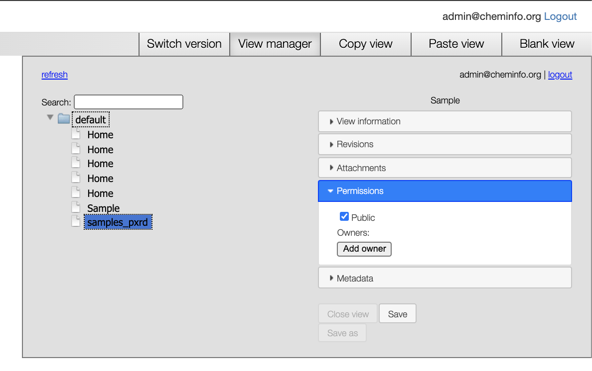
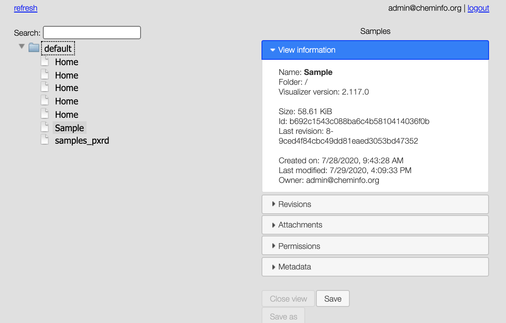

# Personalizando el despliegue

## Edición de la página de inicio

Cuando vaya a su sitio web: `http://localhost/on-tabs/` (después de iniciar sesión con las credenciales especificadas en el archivo `docker-compose.yml`), podrá editar la vista de la página de inicio y definir vistas locales personalizadas.

Verá un administrador de vistas como se muestra a continuación

que le permite alternar entre revisiones.

Si desea cambiar, por ejemplo, los mosaicos que se muestran en la pantalla de inicio, puede hacer clic con el botón derecho y luego seleccionar `switch to layer/Links` donde podrá eliminar, mover y agregar mosaicos.

Lo que, por ejemplo, podría querer hacer es cambiar el documento al que se redirige el botón de ayuda.
Para esto, puede ir al sitio web `on-tabs`, hacer clic derecho y seleccionar `Global preferences`, luego en `Action Scripting` puede editar la `Action Help`

## Modificando vistas

Las vistas son archivos `json` para el [visualizer](https://github.com/NPellet/visualizer) para los cuales [hay un tutorial en cheminfo.org](http://www.cheminfo.org/Tutorial/1._Introduction/1.1_Basic_example/index.html).

Para desarrollar sus propias vistas (o personalizar vistas como la de los ejemplos), puede usar `https://my.cheminfo.org/`.

Para usar una vista que guardó localmente usando el sitio web `on-tabs` (`http://localhost/on-tabs/`, por ejemplo, pegue una vista desarrollada en https://my.cheminfo.org/), los permisos deben establecerse en `public`.

Luego, el `uuid` debe tener el prefijo `private/`. Es decir, para el ejemplo que se muestra a continuación, uno agregaría `private/b692c1543c088ba6c4b5810414036f0b` como URL en la vista de `links` del ELN.

.
