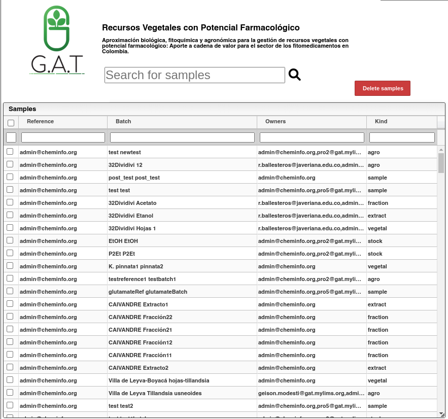

# Delete

Para eliminar una o varias muestras, es necesario realizar la selección o deselección correspondiente dentro del módulo de muestras, mediante la manipulación de la caja de selección de muestras. Una vez concluida la selección, se debe presionar el botón rojo denominado "Delete samples", ubicado en la parte superior derecha del mencionado módulo. El proceso se llevará a cabo automáticamente, y una vez recargadas las vistas, los cambios deberían reflejarse adecuadamente.

