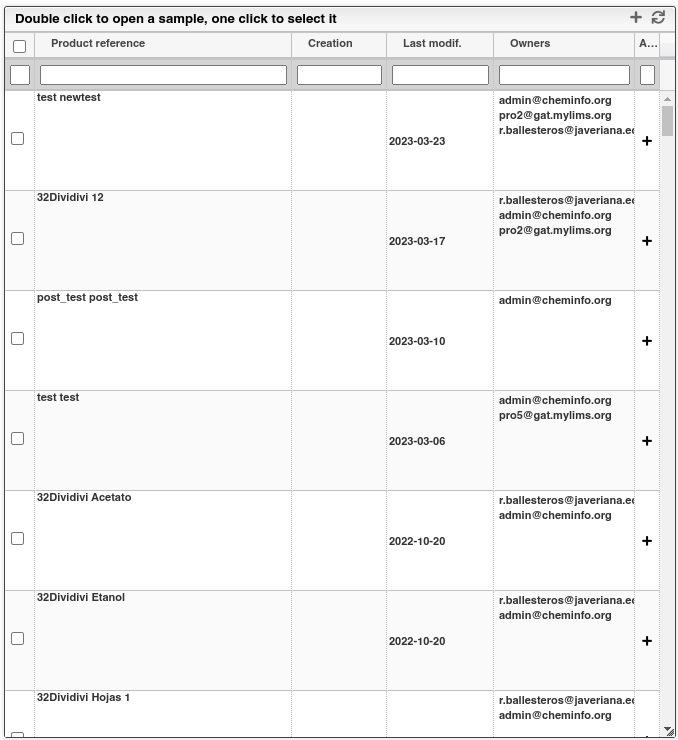
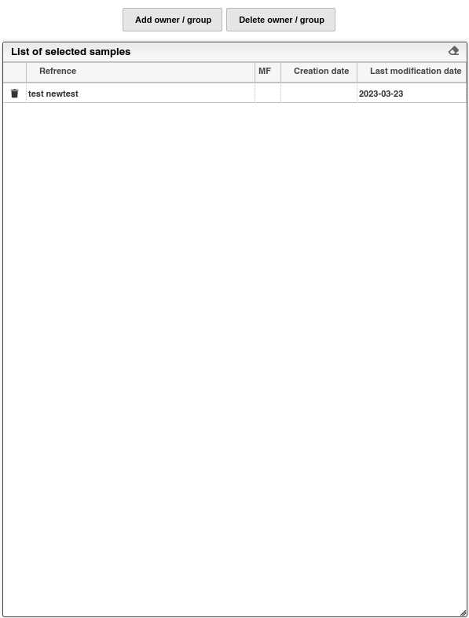

# Derechos de muestras

## Seleccionar muestras.

Para seleccionar múltiples muestras en el módulo de muestras, simplemente debe activar o desactivar las casillas correspondientes a cada muestra en la primera columna. Para añadir o eliminar las muestras seleccionadas de la lista de "Muestras seleccionadas", es necesario hacer clic en el botón etiquetado con un signo de '+' ubicado en la parte superior derecha del módulo de muestras.

## Agregar y/o remover permisos.

Las muestras agregadas se mostrarán en el módulo "Muestras seleccionadas". Para asignar un propietario a las muestras seleccionadas, simplemente haga clic en el botón gris identificado como "Add owner / group". Del mismo modo, para eliminar los permisos de un usuario, siga el proceso descrito anteriormente y haga clic en el botón gris identificado como "Delete owner / group".

Una vez que los permisos hayan sido otorgados o revocados, el efecto será inmediato.
