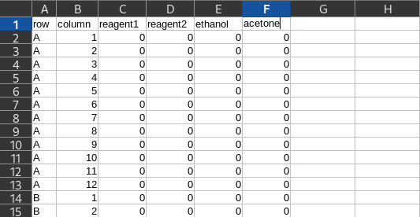
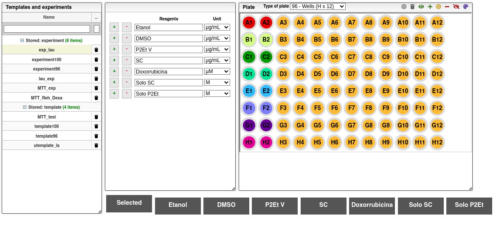
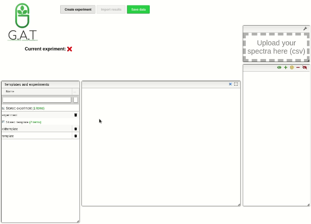
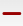
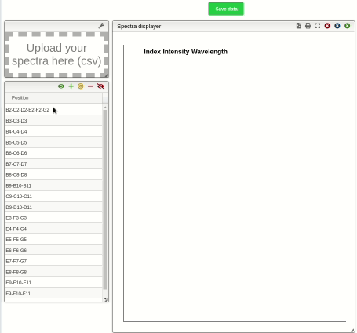
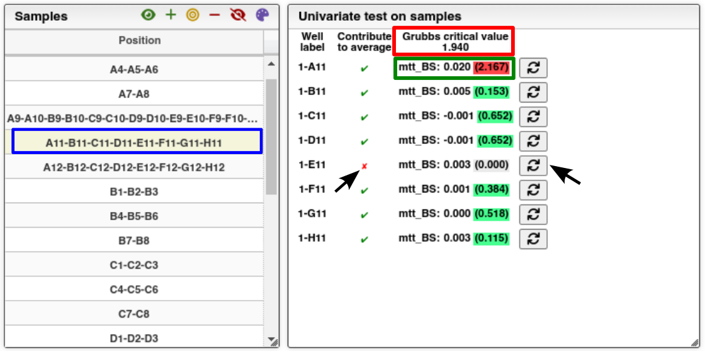
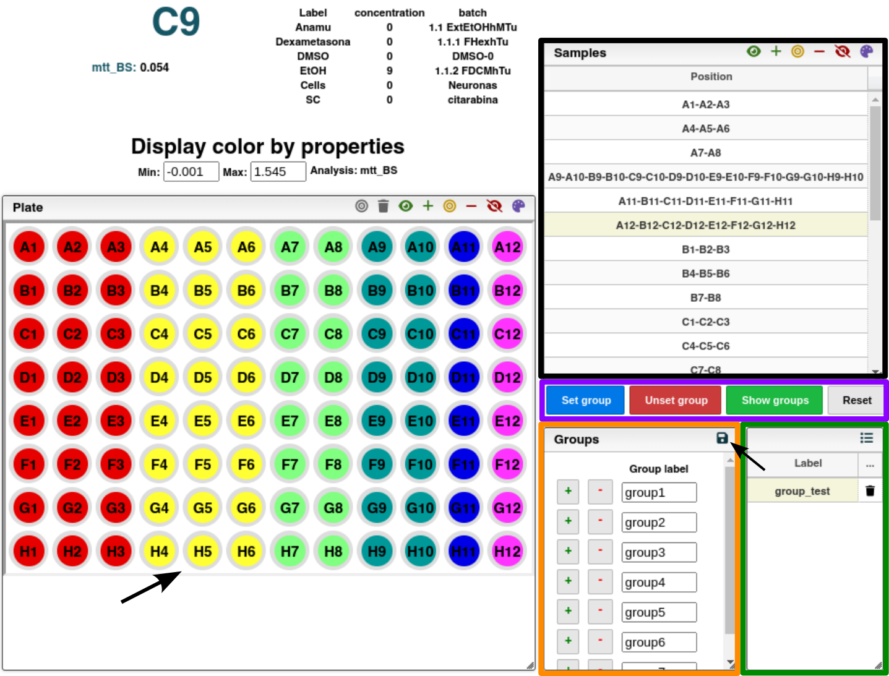
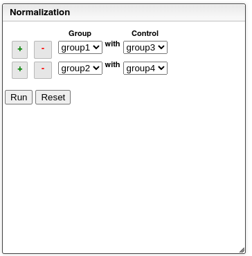
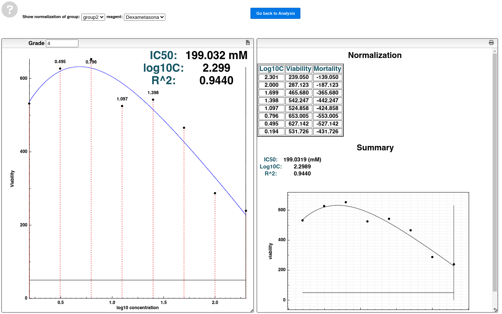

# Well plates

## Crear plantilla

### Desde plantilla CSV

Para comenzar, simplemente haga clic en la flecha negra para descargar una plantilla vacía.

La plantilla en blanco es un archivo CSV, en el cual cada fila representa un pocillo de la placa. Las dos primeras columnas del archivo se utilizan para definir la ubicación de la fila y columna correspondiente del pozo que se desea detallar. Las columnas adicionales especifican la concentración de los reactivos utilizados en el experimento, y el investigador puede agregar tantas columnas como reactivos sean necesarios. Las etiquetas de las columnas correspondientes a los reactivos pueden ser editadas según la preferencia del investigador.

### Creando una plantilla de forma manual en la plataforma

Para crear una plantilla, es necesario ir a la pestaña "Design your template", donde se encontrarán tres módulos. El primero alberga las plantillas y los experimentos previamente guardados. El segundo módulo se utiliza para especificar los reactantes y sus respectivas concentraciones que se utilizarán en los pozos descritos. En el tercer y último módulo, se encuentra el plato de pozos, donde se puede seleccionar manualmente los pozos a los cuales se les asignarán los reactivos y las concentraciones definidos en el segundo módulo y especificar el tipo de plato. Además, se agregó una barra en la parte inferior del plato como una forma de ayuda visual al crear las plantillas, donde se encuentran los reactantes especificados en el segundo módulo. Al seleccionar uno de ellos, los pozos se colorearán dependiendo de la concentración del reactivo.

Para seleccionar pozos en el plato, basta con hacer clic sobre los que se deseen. Los pozos seleccionados se colorearán en rojo. Para registrar la configuración de reactantes y sus concentraciones en los pozos definidos en el segundo módulo, debe hacer clic en el icono  ubicado en la esquina superior derecha del plato. Para eliminar la selección, haga clic nuevamente en los pozos que desee deseleccionar y luego en el icono  de la barra de opciones en la parte superior derecha del plato.

## Cargar y guardar una plantilla para futuros experimentos

Para reutilizar una plantilla previamente guardada, simplemente seleccione una de las disponibles en la ventana. Para cargar una plantilla en la plataforma, arrastre y suelte el archivo de plantilla dentro de la ventana "Importar plantilla" o haga clic en dicha ventana y espere a que aparezca una ventana emergente que le permita seleccionar la plantilla en la ubicación necesaria, y luego presione "Guardar".

## Crear experimentos a partir de plantillas

Para crear un experimento, el primer paso es elegir una plantilla de las disponibles en la ventana. A continuación, se debe vincular cada reactivo especificado en la plantilla a un elemento disponible en la base de datos.

## Cargar datos experimentales

### Espectros de absorción y curvas de crecimiento:

Para cargar los datos, es necesario seguir los siguientes pasos:

- Seleccione el experimento previamente diseñado en la tabla "Plantillas y experimentos".

- Acceda a la pestaña correspondiente, ya sea "Espectros" o "Curvas".
- Haga clic en la ventana "Cargar sus espectros" o "Cargar sus curvas" según sea el caso.
- Espere a que aparezca la ventana emergente.
- Localice y seleccione el archivo que contiene los datos experimentales en la ubicación apropiada.

### Platos:

Para cargar los resultados de platos en los cuales se asigna un único valor numérico a la casilla, como es el caso del análisis MTT, se debe seguir el siguiente proceso:

- Acceda a la pestaña "Analysis".

- Arrastre el archivo en crudo en formato csv o txt hasta la caja respectiva con la etiqueta "Drop the result file (TXT, CSV)".

- El programa se encargará automáticamente de asignar esos valores a los pozos \* correspondientes.

## Visualización

Para facilitar la visualización de gráficos, como curvas de crecimiento, muerte y/o espectros de absorbancia, en la parte superior derecha del módulo de muestras y el plato se encuentran 6 botones con las siguientes funciones:

-  Muestra todos los gráficos.

-  Agrega los gráficos seleccionados a la selección actual.

-  Muestra los gráficos seleccionados.

-  Retira los gráficos seleccionados de la selección actual.

-  Retira todos los gráficos.

-  Colorea los gráficos de diferentes colores.

## Análisis univariado

La plataforma ofrece pruebas univariadas integradas. En el caso de los datos en los que se proporciona un valor por pozo, la herramienta agrupa automáticamente los pozos que pertenecen a una misma muestra y realiza la prueba de Grubbs. Este resultado se puede visualizar en el módulo de pruebas univariadas al seleccionar la muestra deseada, el ejemplo seleccionado está resaltado con un cuadro de color azul en la ilustración.

En el módulo de pruebas univariadas, se presenta información relevante para el análisis de los pozos correspondientes a la muestra. La primera columna muestra las etiquetas de los pozos, mientras que la segunda columna indica con iconos si cada pozo contribuye o no al resultado final. Finalmente, en la tercera columna se presenta el resultado del análisis. La etiqueta de la columna indica el valor crítico para el número de pozos que contribuyen al resultado final, resaltado con un cuadro de color rojo en la ilustración. En los valores de la columna, se muestra el valor del pozo correspondiente seguido del valor de la prueba de Grubbs. Este valor se resalta con un color verde si es menor que el valor crítico y en rojo si es mayor que el valor crítico. Por defecto, se consideran todos los pozos. Sin embargo, el investigador tiene la capacidad de agregar o retirar los pozos que contribuyen al promedio según su criterio. Para hacerlo, solo debe hacer clic en el botón señalado con la flecha negra en la ilustración, y el estado se mostrará inmediatamente.

## Agrupar muestras

La plataforma permite realizar operaciones con grupos de muestras, y se ha implementado un sistema sencillo que permite a los investigadores crear grupos de muestras y guardar esa selección para futuros procesos.

- Crear grupos

Para crear grupos, acceda al módulo de grupos, el cual está resaltado con un cuadro naranja en la ilustración. En este módulo, se pueden crear tantos grupos como sean necesarios mediante el uso de los botones "más" y "menos".

- Seleccionar muestras

Para seleccionar muestras, es necesario dirigirse al módulo correspondiente, que está identificado con un cuadro negro en la ilustración. Una vez allí, es posible seleccionar tantas muestras como se requiera mediante la combinación de teclas Ctrl en sistemas operativos Linux y Windows, o CMD en Mac, y haciendo clic en la muestra deseada. Se pueden seleccionar tantas muestras como sea necesario.

- Asignación de muestras a grupos

Después de realizar la selección previa de las muestras y crear los grupos correspondientes en la herramienta, se debe hacer clic en el botón azul etiquetado como "Set group" (señalado con un cuadro de color púrpura en la ilustración). Inmediatamente, se abrirá una ventana emergente donde se podrá seleccionar el grupo al que pertenecen las muestras y, finalmente, confirmar el cambio haciendo clic en el botón "Ok". Este proceso se puede repetir tantas veces como sea necesario. Si se repite en una muestra que ya tenía asignado un grupo, la muestra se sobrescribirá y se asignará al último grupo asignado. Desde este enfoque, una muestra no puede pertenecer a dos grupos diferentes.

- Desasignación de grupo.

Para desasignar una o varias muestras previamente seleccionadas de un grupo, simplemente se debe hacer clic en el botón rojo etiquetado como "Unset group" (señalado con un cuadro de color púrpura en la ilustración).

- Reiniciar la asignación de grupos.

Para reiniciar la asignación de grupos, basta con hacer clic en el botón gris etiquetado como "Reset" (señalado con un cuadro de color púrpura en la ilustración).

- Verificación

Una vez finalizada la asignación de los grupos, es posible inspeccionar visualmente el resultado, si es necesario. Para ello, se debe hacer clic en el botón verde etiquetado como "Show groups" (señalado con un cuadro de color púrpura en la ilustración). Al hacerlo, en el plato aparecerán coloreados del mismo color todos los pozos que pertenezcan al mismo grupo.

- ¿Cómo guardar la asignación de grupos?

Una vez se ha finalizado y verificado el proceso de asignación de grupos, es posible guardar la asignación de pozos por grupo para evitar repetir este proceso en el futuro. Para ello, basta con hacer clic en el botón con forma de disquete ubicado en la parte superior derecha del módulo de grupos, señalado con la flecha de color negro en la ilustración. Al hacerlo, aparecerá una ventana emergente que solicitará el nombre de dicha asignación. Al escribir el nombre y dar clic en el botón etiquetado como "Ok", esa asignación se guardará en la base de datos y aparecerá automáticamente en el módulo de asignaciones, señalado con un cuadro de color verde en la ilustración, estando disponible para su uso inmediato o en futuros análisis.

## Normalización

Después de asignar los grupos, es posible seleccionar el grupo que se desea normalizar y su control correspondiente en el módulo de normalización de la pestaña de análisis. Una vez que se ha configurado la normalización, se debe hacer clic en el botón gris etiquetado como "Run" para que el programa calcule automáticamente las viabilidades y mortalidades, y asigne los registros correspondientes a las muestras.

Para lograr la visualización del resumen de la normalización, se requiere hacer clic en el botón azul, etiquetado como "Summary", ubicado en la parte superior de la pestaña de análisis. Al hacerlo, se abrirá una pestaña diferente que contendrá un módulo de visualización y un módulo de reporte.

### Configuración del resumen.

Con el fin de visualizar la normalización deseada, en la esquina superior izquierda de la nueva pestaña se encuentran dos selectores. El primer selector, etiquetado como "Show normalization of group", debe ser utilizado para seleccionar el grupo de muestras con la información de normalización. El segundo selector, identificado como "reagent", debe ser empleado para elegir el reactante respecto al cual se realizó la variación de las concentraciones y, de esta forma, obtener los resultados proporcionados en el plato.

### Visualización de resumen.

Al seleccionar de manera adecuada el grupo y el reactante, se generará un gráfico de la viabilidad en función del logaritmo en base 10 de la concentración del reactante previamente seleccionado, junto con un ajuste probable para el grupo de puntos, en el módulo de visualización. (Es importante destacar que también se puede modificar el grado del polinomio utilizado para el ajuste de los puntos. Para hacerlo, simplemente es necesario ingresar el grado deseado en la parte superior izquierda del módulo de visualización)

### Reporte

En el módulo de reporte, se presentará una tabla que incluirá los valores del logaritmo en base 10 de la concentración del reactante seleccionado, así como la viabilidad y la mortalidad. Además, se proporcionará información sobre la gráfica, el posible valor de IC50 y el coeficiente de determinación (R2) del ajuste. Además, este reporte se podrá descargar en formato PDF al presionar el botón en forma de impresora ubicado en la parte superior derecha del módulo de reporte.

Para volver a la pestaña de análisis, es necesario hacer clic en el botón azul etiquetado como "Go back to Analysis", el cual se encuentra ubicado en la parte superior de la pestaña de resumen

## Verifica los resultados y guárdalos

Para garantizar la persistencia de los datos cargados en la base de datos, se requiere hacer clic en el botón verde etiquetado como "Save data". Este botón se encuentra ubicado en la parte superior de la pestaña principal de la herramienta.
