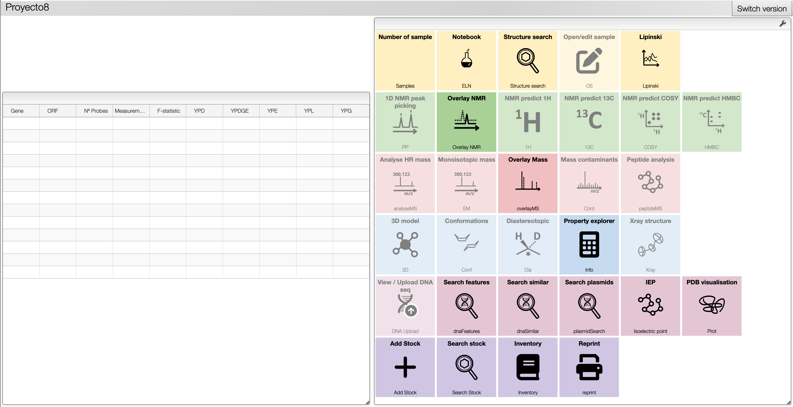

# Plataforma De Investigación Traslacional Biomédica Para El Almacenamiento, Administración, Análisis E Integración De La Información Clínica, Ómica, Fitoquímica, Agronómica Y Farmacológica

**Documentación de la API: https://gat.stoplight.io/docs/gat/branches/main/osk8663ryfthv-gat**

**Colección de Postman: https://github.com/darmn-js/outcome-depot/blob/main/src/API/GAT.postman_collection.json**

- [Documentación de la herramienta de well-plates](https://github.com/darmn-js/outcome-depot/tree/main/src/web-tools/well-plates)
- [Manejo de permisos de las muestras](https://github.com/darmn-js/outcome-depot/tree/main/src/web-tools/sample-rights)

Este es el menú principal de la plataforma. No es necesario estar autenticado para acceder a esta página. 

## Creación de usuarios

Enviar un correo a andres.m.castillo@correounivalle.edu.co, especificando el proyecto al cual pertenece. Recibirá la notificación de postmaster dentro de las siguientes 24 horas, después de la aprobación de las directivas del proyecto.

## login
Luego de presionar el botón de login en la esquina superior derecha de la página de bienvenida, será redirigido al formulario de autenticación. Por ahora solo está disponible el login usando CouchDB. 

En el formulario digite su usuario y contaseña y presione el botón de ingresar.

## proyecto1

## proyecto2

## proyecto3

## proyecto4

## proyecto5

## proyecto6

## proyecto7

## proyecto8

## proyecto9

